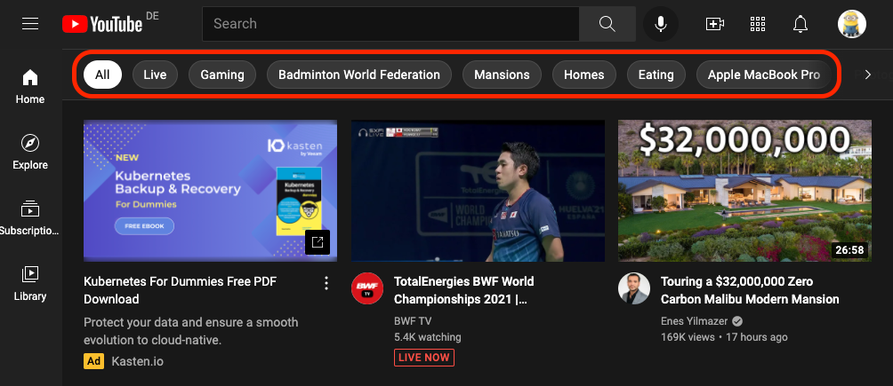
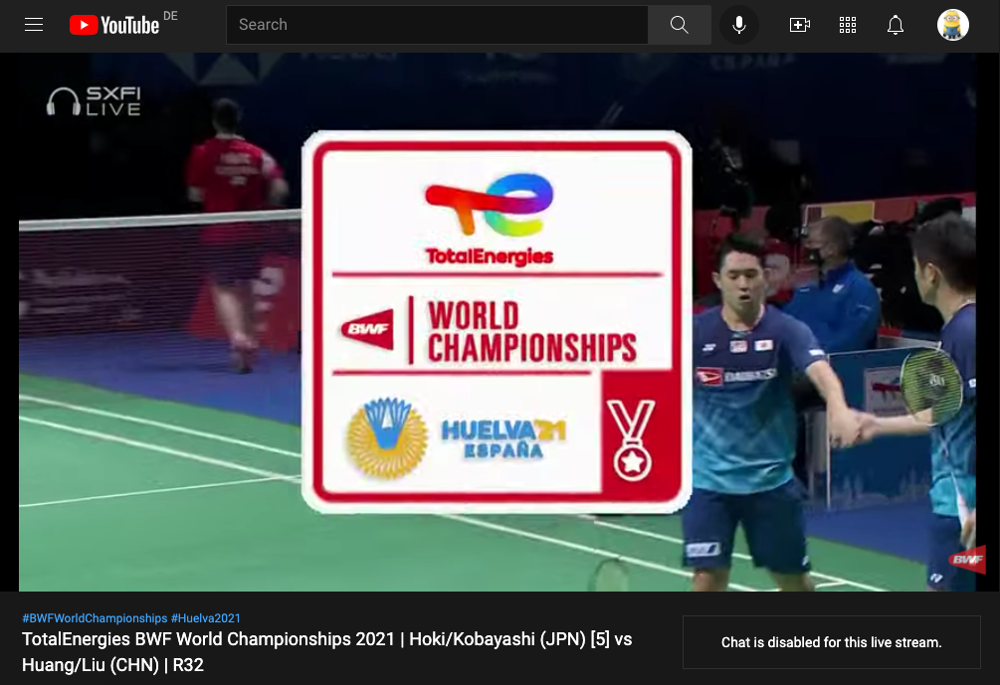

# Data Objects

There are only three kinds of data objects in Gorse: users, items and feedbacks.

## User

- A user object consists of a user ID and labels describing the user. The user labels can be empty, but these labels help to improve recommendation.

```go
type User struct {
    UserId    string	// user ID
    Labels    []string	// labels describing the user
}
```

## Item

An item consists of 6 fields:

```go
type Item struct {
	ItemId     string
	IsHidden   bool
	Categories []string
	Timestamp  time.Time
	Labels     []string
	Comment    string
}
```

| Field | Description |
|---|---|
| `ItemId` | The unique identifier of the item and cannot contain a slash "/" because of conflicts with the URL definition of the RESTful APIs. |
| `IsHidden` | Whether the item is hidden, after setting true, the item will no longer appear in the recommendation results. |
| `Categories` | The categories to which the item belongs, the item is recommended under these categories. |
| `Timestamp` | The timestamp of the item, which is used to determine the freshness of the item. |
| `Labels` | The item's label information, which is used to describe the item's characteristics to the recommender system. |
| `Comment` | The item's comment information, which helps to browse items and recommendation results in the dashboard. |

### Hide Items

In many cases, items in the history are not available for recommendation to other users, e.g.
- If the item is sold out, it can't be recommended to other users.
- If the item is legally risky, it cannot continue to be recommended to other users either.

In Gorse, items can be taken down by setting `IsHidden` to `true` for the item via the RESTful API. The recommendation algorithm can use the item during training, but the item will no longer be recommended to other users. Setting `IsHidden` to `true` takes effect immediately, but setting it to `false` resumes item recommendations after the `refresh_recommend_period` has expired.

### Multi-Categories Recommendation

Multi-categories recommendations are common, take YouTube for example, where multiple recommendation categories are provided on the homepage.



Multiple categories can be distinguished by topics such as food, travel, etc., or by forms, e.g. live, short and long videos. Items will definitely appear in the global recommendation stream, and in addition the `Categories` field determines which recommendation categories the items should appear in. For each recommendation API, there are a global version and category version:

| METHOD |  URL |   DESCRIPTION |
|-|-|-|
| `GET` | `/api/latest` | Get latest items. |
| `GET` | `/api/latest/{category}` | Get latest items in specified category. |
| `GET` | `/api/popular` | Get popular items. |
| `GET` | `/api/popular/{category}` | Get popular items in specified category. |
| `GET` | `/api/recommend/{user-id}` | Get recommendation for user. |
| `GET` | `/api/recommend/{user-id}/{category}` | Get recommendation for user in specified category. |
| `GET` | `/api/item/{item-id}/neighbors` | Get neighbors of a item. |
| `GET` | `/api/item/{item-id}/neighbors/{category}` | Get neighbors of a item in specified category. |

For example, for a live badminton match, you can set its `Categories` to "Live" and "Sports". In this way, in addition to the default recommendation stream, the user can find the live stream in the "Live" and "Sports" recommendation categories.



::: warning

Multi-column recommendations will consume more cache storage space.

:::

### Using Labels to Describe Items

If only the item ID is available, the recommender system has no knowledge of the item's content, which requires labels to help the recommender system understand the item.

- **User-Generated Label**: Human-supplied labels are generally the most accurate and can be added by editors or users. For example, for a game, editors can add publisher and genres as labels, and users can add topics about the game as labels.
- **Automatic Label Extraction**: Unfortunately, in many cases, items do not have ready-made labels, so it is necessary to use machine learning to automatically generate labels for items.
  - **Image Classification**: The class of image is used as a label, for example, to classify whether the image is a girl, a boy, a cat or a dog.
  - **Object Detection**: Detect the objects contained in the image as labels, e.g. detecting the image as having a girl with a cat.
  - **Keyword Extraction**: Extract the keywords of the text, e.g. an article talks about deep learning based recommender systems, the keywords are deep learning and recommender system.
  - **Text Classification**: Classify the content of a article, for example, to determine whether a tweet is confiding, dating or job hunting.

Generating high-quality labels for items is a difficult task, and low-quality labels might harm the accuracy of the recommender system.

## Feedback

- A feedback consists of user ID, item ID, feedback type, and feedback timestamp, where the triad of user ID, item ID, and feedback type is required to be unique in the database.

```go
type Feedback struct {
    FeedbackType string		// feedback type
    UserId       string		// user id
    ItemId       string		// item id
    Timestamp    time.Time	// feedback timestamp
}
```

Feedback represents events that happened between users and items, which can be positive or negative. For example, sharing and liking are the user's positive feedback to an item. If the user does not have further positive feedback after reading, the user's feedback on the item is considered negative. If the user views the item, read feedback will be recorded. Then, if the user gives positive feedback to the item, the read feedback will be overwritten by the positive feedback. Conversely, if the user does not give positive feedback, then the read feedback is considered negative feedback.

### Positive Feedback and Read Feedback

Before inserting feedback into the Gorse recommender system, it is necessary to define which of the user's behaviors are positive feedback and which are read feedback. Read feedback is relatively easy to define, as it can be recorded as read feedback when a user has seen the recommended item. However, the definition of positive feedback depends more on the specific scenario. For TikTok, users can be considered as positive feedback if they “like” or “share” the current video; for YouTube, users can be considered as positive feedback if they watch the video to a certain proportion of completion, “like“ the video, or "share" the video. To summarize, positive feedback and read feedback are defined by the following rules.

- **Read Feedback:** The user sees the item.
- **Positive feedback:** The user action that is expected to do by the service provider.

For example, if Gabe Newell wants to build a recommender system for Steam based on Gorse, clicking into the game introduction page could be treated as read feedback (the game list page has too little information to determine that the user has read it), and then actions such as adding a wish list and adding a shopping cart are treated as positive feedback. Finally, set them in the configuration file as follows.

```toml
[recommend.data_source]

# Add to wishlist or cart
positive_feedback_types = ["wish_list", "cart"]

# Read the game introduction page
read_feedback_types = ["read"]
```

### Insert Positive Feedback

For positive feedback, it can be inserted when the user performs the action, where the timestamp is the current timestamp.

```bash
curl -X POST "http://127.0.0.1:8088/api/feedback" \
    -H "accept: application/json" \
    -H "Content-Type: application/json" \
    -d '[ { "FeedbackType": "read", "ItemId": "10086", "Timestamp": "2021-10-24T06:42:20.207Z", "UserId": "jack" }]'
```

### Insert Read Feedback

For read feedback, the timestamp can be used to set the timeout of the recommendation results, in addition to recording the read time.

#### Proactive Insertion

Positive feedback can be inserted into the recommender system when the user takes the action, while read feedback requires the application to detect the user's "read" behavior. The methods for displaying recommendations vary by application but can be generally grouped into two categories.

- **Full-screen mode:** The most typical application is TikTok, where the user is considered "read" when the full-screen content is shown to them. That is, the application can write a "read" feedback to the recommender system when the recommended content is shown to the user, and the read content will no longer be shown to the user.

::: center


:::

- **List mode:** The most typical application is YouTube, where the user is not considered "read" after looking at multiple videos in the list. When there are more than one videos, the user's attention is not able to browse the whole list. Moreover, if the read content is quickly discarded in the list mode, the recommended content is consumed too fast. Therefore, the best solution is to write a "read" feedback with a future timestamp to the recommender system when the item is presented to the user in the stream, and the "read" feedback will take effect when the time has reached the timestamp, and the read content will no longer be presented to the user.

#### Automatic Insertion

Proactively inserting read feedback to the recommender system requires the application to be able to accurately capture user browsing behavior. This task is easier for mobile applications but more difficult for web applications. To address this problem, Gorse's API for getting recommendation results provides two parameters: `write−back−type` and `write−back−delay`.

- **In full-screen mode:** Get a recommendation and write a "read" feedback, the recommendation will not appear again afterward.

```bash
curl -X GET "http://172.18.0.3:8087/api/recommend/zhenghaoz?write-back-type=read&n=1" \
    -H "accept: application/json" \
    -H "X-API-Key: 19260817"
```

- **In list mode:** Get 10 recommendations and write "read" feedback with timestamps of 10 minutes later. The 10 recommendations will not be discarded until after 10 minutes.

```bash
curl -X GET "http://172.18.0.3:8087/api/recommend/zhenghaoz?write-back-type=read&write-back-delay=10m&n=10" \
    -H "accept: application/json" \
    -H "X-API-Key: 19260817"
```

The `write−back−type` and `write−back−delay` parameters of the recommendation API provide a convenient way to insert read feedback, but of course, if you want the read feedback to be more accurate, it should be written to the recommender system by the application.

