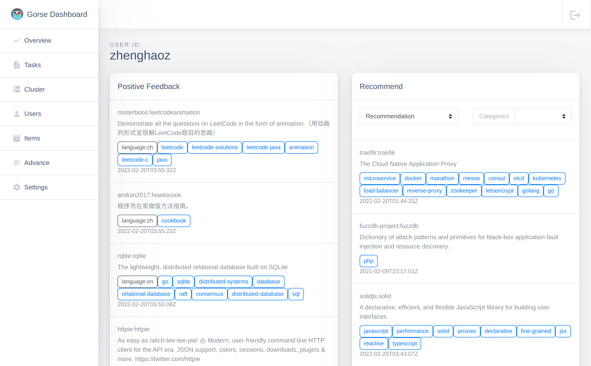
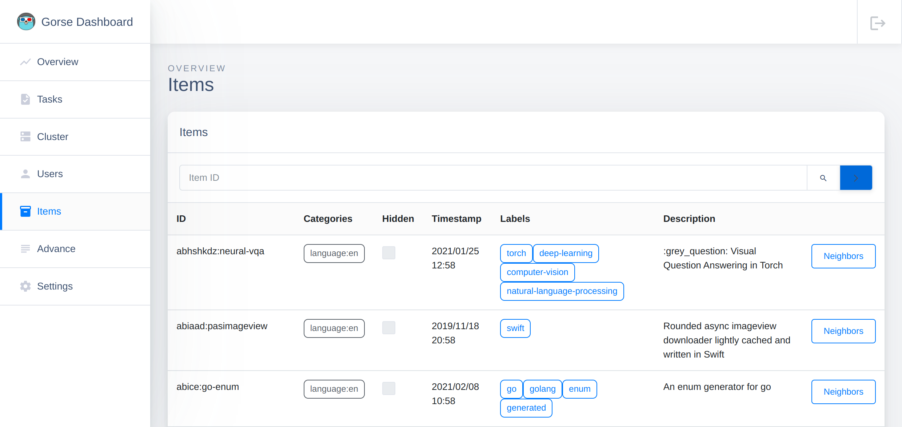
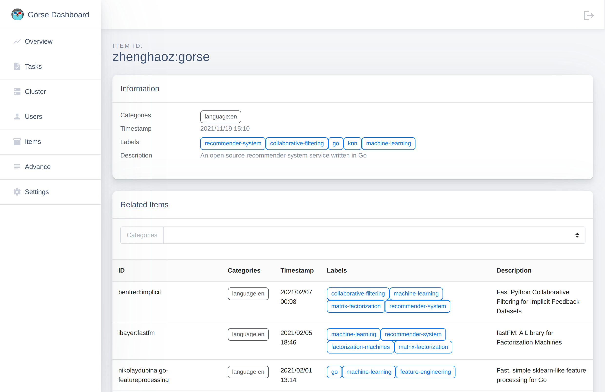
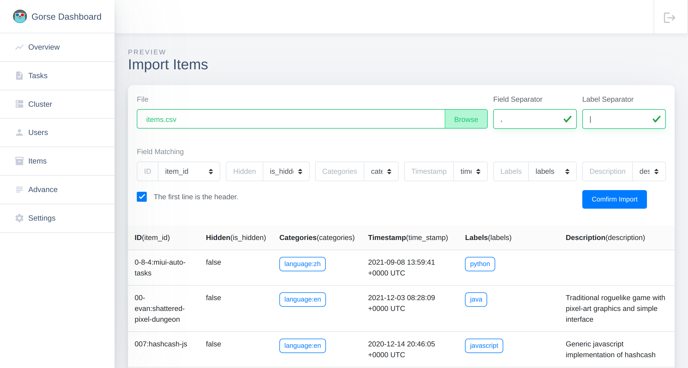
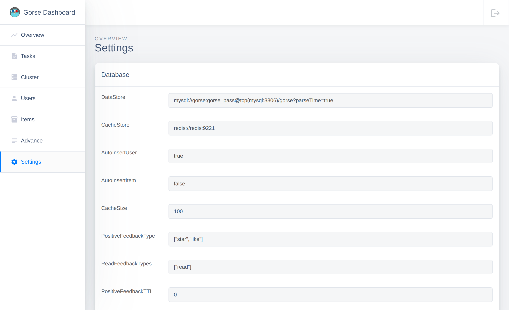

# Gorse 控制台

Gorse 的主节点提供了 Gorse 控制台，并可以通过主节点的 HTTP 端口（默认为`8088` ）访问。 HTTP 端口可在配置文件中指定。控制台可以让您观察推荐系统的当前状态，预览用户推荐结果，导入和导出数据。

## 登录页

默认配置允许不登录就可以访问控制台。在配置文件中可以设置登录控制台的用户名和密码。

```toml
[master]

# Username for the master node dashboard.
dashboard_user_name = ""

# Password for the master node dashboard.
dashboard_password = ""
```

设置用户名和密码后，您将在第一次访问控制台时被重定向到登录页面。

::: center

:::

## 概述页

概览页面的顶部显示了 Gorse 中的用户数、物品数、反馈数、有效正反馈和有效负反馈。概览页面的中间部分显示了用户在一段时间内给出的每种正面反馈的比例变化，点击反馈类型标签可以隐藏相应曲线。总览页面底部显示系统中的热门物品和最新物品，以及系统中的其他状态。


## 任务页

任务页面显示 Gorse 中的任务，包括任务名称、任务状态、任务开始时间、任务结束时间和任务进度。


## 集群页

集群页面列出集群中的节点。


## 用户页

用户页面列出了 Gorse 当前存在的所有用户，可以通过用户 ID 进行搜索。显示的信息包括用户ID、用户标签、最后活跃时间和推荐的最后更新时间。


点击“Neighbors”按钮可以查看与该用户相似的用户。


点击“Insight”按钮可查看用户的历史记录以及 Gorse 为该用户生成的推荐。



## 物品页

物品页面列出了目前 Gorse 中的所有物品，可以通过物品ID进行搜索。显示的信息包括物品ID、物品类别、是否隐藏、时间戳、物品标签和物品描述。



点击“Neighbors”按钮以查看每个物品的相似物品。



## 数据导出和导入页

“Advance”页面允许导入和导出数据。

- “Export Users”按钮将用户导出到 CSV 文件，格式为用户 ID、用户标签。
- “Export Items”按钮将物品导出到 CSV 文件，格式为物品 ID、隐藏与否、物品类别、时间戳、物品标签和物品描述。
- “Export Feedback”按钮以反馈类型、用户 ID、物品 ID 和时间戳的格式将反馈导出到 CSV 文件。


- 点击“Import Users”按钮进入导入用户页面并预览导入的数据。您可以设置字段分隔符、标签分隔符、每个字段的映射以及标题行是否存在。设置无误后，点击“Confirm Import”即可完成数据导入。


- 点击“Import Items”按钮进入导入物品页面，其操作逻辑与导入用户页面相同。



- 点击“Import Feedback”按钮进入导入反馈页面，其逻辑与导入用户相同。


## 配置页

配置页面显示了 Gorse 当前使用的配置。系统使用的配置是由配置文件、命令行选项和环境变量共同决定的，因此在设置页面看到的配置和使用的配置文件可能存在差异。


